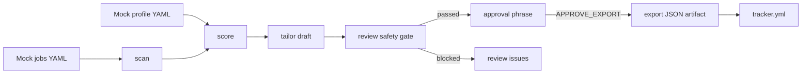

# Career-Ops CLI

Career-Ops CLI is a public-safe Python developer tooling project for job-search
workflow automation. It demonstrates CLI design, structured YAML/JSON data,
explainable scoring, no-invention safety review, human approval gates, tracker
output, and pytest coverage.

The repository is designed for portfolio review. All bundled data is synthetic.
It does not contain real CVs, real applications, private job memory, emails,
phone numbers, addresses, transcripts, or submitted materials.

## What It Proves

- Python package structure under `src/career_ops_cli`
- Typer CLI with `scan`, `score`, `tailor`, `review`, `tracker`, and `export`
- Mock job scan input, mock candidate profile, and mock tracker data
- Deterministic job-fit scoring with an explicit rubric
- Evidence-backed drafting that labels gaps instead of hiding them
- No-invention review before anything can be exported
- Human approval gate before final artifact export
- JSON and YAML outputs for automation and audit trails
- pytest coverage for scoring, safety review, export gates, and CLI behavior

## Quick Start

```powershell
python -m pip install -e ".[dev]"; career-ops tracker --json
```

If you prefer not to install the console script:

```powershell
$env:PYTHONPATH='src'; python -m career_ops_cli.cli tracker --json
```

## Commands

```powershell
career-ops scan --input examples/mock/jobs.yml
career-ops score --jobs examples/mock/jobs.yml --profile examples/mock/profile.yml --json
career-ops tailor --jobs examples/mock/jobs.yml --profile examples/mock/profile.yml --job-id mock-job-003
career-ops review --jobs examples/mock/jobs.yml --profile examples/mock/profile.yml --job-id mock-job-003
career-ops export --jobs examples/mock/jobs.yml --profile examples/mock/profile.yml --job-id mock-job-001 --approve APPROVE_EXPORT
```

`export` refuses to write final artifacts unless the safety review passes and
the approval phrase is exactly `APPROVE_EXPORT`.

## Demo Output

`career-ops score --jobs examples/mock/jobs.yml --profile examples/mock/profile.yml --job-id mock-job-003`

```text
Scored 1 job(s) for Alex Morgan
mock-job-003 | HelioGrid Systems | Developer Tools Working Student | 81.8/100 | good_match | required gaps: Git
```

`career-ops tailor --jobs examples/mock/jobs.yml --profile examples/mock/profile.yml --job-id mock-job-003`

```text
Draft for HelioGrid Systems - Developer Tools Working Student
Final: False; approval required: True
Draft only: Alex Morgan is a good match for Developer Tools Working Student at HelioGrid Systems...
- Known gaps to avoid claiming: Git, structured logging.
- Human approval is required before any final artifact is exported.
```

## Architecture



## Safety Philosophy

Career-Ops CLI is a decision-support tool, not an application bot.

- It never submits applications.
- It never sends email.
- It never scrapes live job boards in the public demo flow.
- It uses synthetic fixtures by default.
- It does not turn gaps into claims.
- It keeps generated text draft-only until review passes.
- It requires a human approval phrase before export.

The most important design choice is that gaps remain visible. For example, if a
job asks for `Git` and the mock profile only supports `GitHub Actions`, the tool
does not treat that as equivalent. The draft says the gap exists.

## Project Layout

```text
career-ops/
  src/career_ops_cli/
    cli.py          # Typer command surface
    scanner.py      # mock scan fixture loading and filtering
    scoring.py      # deterministic scoring rubric
    tailoring.py    # draft-only evidence-backed tailoring
    safety.py       # no-invention and blocked-action review
    exporter.py     # approval-gated artifact export
    tracker.py      # structured tracker records
  examples/mock/
    jobs.yml        # synthetic postings
    profile.yml     # synthetic candidate profile
    tracker.yml     # synthetic tracker sample
  tests/
    test_scan.py
    test_score.py
    test_tailor.py
    test_review_export.py
```

## Development

```powershell
python -m pip install -e ".[dev]"
python -m pytest
python -m compileall -q src tests
```

Expected result:

```text
21 passed
```

## Public-Safe Data Policy

Only synthetic data belongs in this repository. Do not commit real CVs, real
cover letters, real application trackers, private job-search memory, personal
contact information, or generated submissions. Local export output is written to
`exports/`, which is ignored by Git.

## License

MIT
